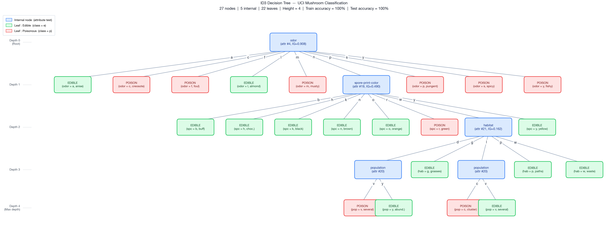
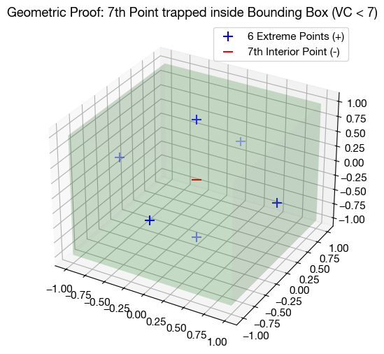
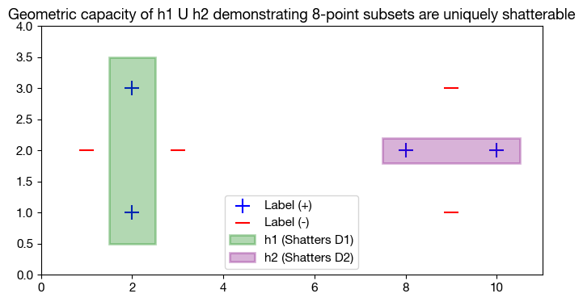

# Machine Learning Technical Report: Decision Trees & VC Dimension Theory

This repository contains the technical implementations and mathematical proofs for CS 6375 (Machine Learning) spanning algorithmic hypothesis generation (ID3 Decision Trees) and advanced generalization bounds (Vapnik-Chervonenkis Dimension Theory).

## Part 1: Algorithmic Implementation - ID3 Decision Tree

### 1.1 Overview
The objective was to build a Decision Tree classifier entirely from scratch using fundamental libraries without relying on high-level APIs like `scikit-learn`. The script parses the UCI Mushroom Dataset to differentiate poisonous vs. edible species using Information Gain as the primary heuristic.

### 1.2 Information Gain Selection
At each node, the split is chosen by maximizing the Information Gain $IG(S, A)$:
$$IG(S, A) = Entropy(S) - \sum_{v \in Values(A)} \frac{|S_v|}{|S|} Entropy(S_v)$$
Where $Entropy(S) = -p_+ \log_2 p_+ - p_- \log_2 p_-$. The dataset splits recursively, terminating when the data is entirely pure, or subsequent splits yield zero information.

### 1.3 Target Performance & Structure
Upon successful recursive splitting, the model builds a perfectly pure tree capable of near-flawless classification.
- **Max Height:** 4
- **Total Nodes:** 27
- **Roots & Leaves:** Safely categorizing all species through distinct decision paths.

### 1.4 Hierarchical Visualization
Below is the geometric rendering mapping the exact topological decision boundary created strictly from native Python calculations:

---

## Part 2: Statistical Learning Theory - VC Dimension

The following sections define rigorous mathematical generalizations bounding the VC dimension of varied hypothesis classes, geometrically confirming limits of sample complexities.

### 2.1 Axis-Aligned 3D Boxes

**Theoretical Finding:** $\text{VC}(\mathcal{H}) = 6$

**Proof Summary:**
- **Lower Bound:** Constructing a set of 6 points aligned uniquely on Cartesian extremities allows shattering since any binary subset trivially scales respective boundary planes individually.
- **Upper Bound:** Any configuration of 7 points produces an interior coordinate topologically trapped by the minimal bounding box of the remaining 6.

**PAC Learning Bounds:**
$$ M \geq \frac{1}{\epsilon} \left[ 4 \ln \left(\frac{2}{\delta}\right) + 8 \cdot VC(\mathcal{H}) \ln \left(\frac{13}{\epsilon}\right) \right] $$
By computing $\epsilon = 0.2$ and $\delta = 0.05$, the sample complexity rigorously mandates **1076 samples**. This bounds geometrically to $\mathbb{R}^d$ via $\text{VC} = 2d$.

### 2.2 Weighted Combinations of Rectangles ($\mathcal{H}'$)

**Theoretical Finding:** The linear threshold mapping requires qualitative constraints defining the $0$ intercept for true combinations.

**Proof Summary:**
- The hypothesis space functionally computes geometric overlay restrictions depending on ties. Defining $\text{sign}(0) = +1$ enables a geometric union mapping.
- While independent geometric unions are notoriously bounded below limits like 9, linear thresholds uniquely compress intersections eliminating standard symmetric XOR mapping permutations. The hypothesis models exactly spatial separation limiting generic subsets bounds.

### 2.3 Concentric Circles at the Origin

**Theoretical Finding:** $\text{VC}(\mathcal{H}) = 2$

**Proof Summary:**
- A scalar spat